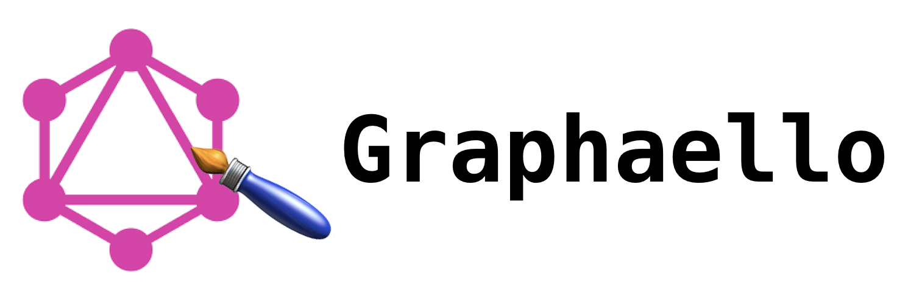

# Graphaello

Use GraphQL directly from your SwiftUI.
Graphaello is a Code Generation Command Line Tool that allows you to use Annotations in your SwiftUI Views.

Let's cut the chase and go directly to our first example of a View using Graphaello:

```swift
struct CharacterCell: View {
    @GraphQL(StarWars.Person.name)
    var name: String?

    @GraphQL(StarWars.Person.homeworld.name)
    var home: String?

    var body: some View {
        HStack {
            name.map { Text($0).bold() }
            Spacer()
            home.map { Text($0) }
        }
    }
}
```

**And did I mention it's all type safe?!?!**

## Instalation

Graphaello can be installed via Homebrew:

```
brew tap mmq/formulae https://bitbucket.ase.in.tum.de/scm/mmq/formulae.git
brew install graphaello
```

## Usage

We will cover how to use Graphaello from two sides. 

- What can you do in your code, 
- and how to you use the Command Line Tool:

### Code

Almost all examples will refer to the Star Wars API: https://swapi-graphql.netlify.com

#### Views

You very easily use infromation from a GraphQL API directly from your SwiftUI View:

For example this `CharacterCell` displays a single Cell with a Person's Name and Home World

```swift
struct CharacterCell: View {
    @GraphQL(StarWars.Person.name)
    var name: String?

    @GraphQL(StarWars.Person.homeworld.name)
    var home: String?

    var body: some View {
        HStack {
            name.map { Text($0).bold() }
            Spacer()
            home.map { Text($0) }
        }
    }
}

// Initializer is automatically created by Graphaello
let view = CharacterCell(person: person)
```

#### Composing Views

If your view has a sub view with it's own data, your view doesn't need to know the specifics of it, but only the fact that it needs to populate it:

```swift
struct CharacterDetail: View {
    @GraphQL(StarWars.Person._fragment)
    var headerCell: CharacterCell.Person // The type CharacterCell.Person is created by Graphaello for you
    
    @GraphQL(StarWars.Person.eyes)
    var eyes: String?

    var body: some View {
        VStack {
           CharacterCell(person: headerCell)
           eyes.map { Text($0) }
        }
    }
}

let view = CharacterDetail(person: person)
```

#### Using Queries

You can access any query fields of the API directly: 

```swift
struct FilmView {
  // .film refers to a field in the query
  @GraphQL(StarWars.film.title)
  var title: String?
  
  var body: String {
    title.map { Text($0) }
  }
}

let client = ApolloClient(url: ...)
let api = StarWars(client: client)

let view = api.filmView(id: ...)
```

#### Using Mutations

All mutations can directly be used from `{API_NAME}.Mutation`. For this example we're using a TODO app since the Star Wars API doesn't support mutations:

```swift
struct TodoCell: View {
    // _nonNull() is equivalent to !
    @GraphQL(Todos.Todo.id._nonNull())
    var id: String

    // _withDefault(FOO) is equivalent to ?? FOO
    @GraphQL(Todos.Todo.title._withDefault(""))
    var title: String
    
    @GraphQL(Todos.Todo.completed._withDefault(false))
    var completed: Bool

    @GraphQL(Todos.Mutation.toggle.completed._withDefault(false))
    var toggle: Toggle // Define a type name for your mutation

    var body: some View {
        HStack {
            Text(title)

            Spacer()
            
            Button(completed ? "Mark as not done" : "Mark as done) {
              toggle.commit(id: self.id)
            }

            ActivityIndicator().animated(toggle.isLoading)
        }
    }
}
```

#### Using Paging

If your API suppors Connections you can include paging in your App out of the box:

```swift
struct CharacterList: View {
    @GraphQL(StarWars.allPeople._nonNull())
    var characters: Paging<CharacterCell.Person>

    var body: some View {
        List {
            ForEach(characters.values) { character in 
                CharacterCell(person: character)
            }
            
            characters.hasMore ? Button("Load More") {
              self.characters.loadMore()
            }.disabled(characters.isLoading) : nil
        }
    }
}
```

Or you can even use the Shipped `PagingView` and items will automatically load when you get near the end of the list:

```swift
struct CharacterList: View {
    @GraphQL(StarWars.allPeople._nonNull())
    var characters: Paging<CharacterCell.Person>

    var body: some View {
        List {
            PagingView(characters) { character in
                CharacterCell(person: character)
            }
        }
    }
}
```

#### Handling arguments

Whevener you use fields with arguments, those arguments are propagated to whoever uses your view. But you can also prefill them from the `@GraphQL` annotation. You can :

- Use the default from the API (default behavior)
- Force them to be filled by the caller
- Hard code them
- Override the default value

**Default**

```swift
struct FilmView {
  @GraphQL(StarWars.film.title)
  var title: String?
  
  var body: String {
    title.map { Text($0) }
  }
}

...
let first = api.filmView(id: ...)
let second = api.filmView() // uses the default from the API
```

**Force them**

```swift
struct FilmView {
  @GraphQL(StarWars.film(id: .argument).title)
  var title: String?
  
  var body: String {
    title.map { Text($0) }
  }
}

...
let view = api.filmView(id: ...) // id is required
```

**Hardcode them**

```swift
struct MyFavoriteFilmView {
  @GraphQL(StarWars.film(id: .value("...")).title)
  var title: String?
  
  var body: String {
    title.map { Text($0) }
  }
}

...
let view = api.filmView() // id is not available as an argument
```

**Override the default**

```swift
struct FilmView {
  @GraphQL(StarWars.film(id: .argument(default: "...")).title)
  var title: String?
  
  var body: String {
    title.map { Text($0) }
  }
}

...
let first = api.filmView(id: ...)
let second = api.filmView() // uses the default set by the View
```

#### Other operations

There are other operations available on Paths for Graphaello:

- **_forEach(\.{keyPath})** instead of getting an array of objects you can just get a specific value (will be transformed into an Array.map)
- **_compactMap()** remove nils from an array (will be transformed into a `compactMap { $0 }`)
- **_withDefault({y})** add a default value in case of nil (will be transformed into ` ?? y`)
- **_nonNull()** force non null values (will be transformed into a `!`)
- **_flatten** flatten an array of arrays (will be transformed into a `flatMap { $0 }`

### Command Line Tool

The Graphaello Tool is pretty simple and only has three commands:

- codegen: generates all the necessary code and injects it into your project
- init: will install all dependencies and add a custom Graphaello buildphase (so that you don't need to use codegen manually)
- add: will add a GraphQL API to your project

#### Codegen

Will generate all the swift code an insert it into your project.

**Arguments:**

Project: points to the project. If not provided will pick the first project in your current working directory
Apollo: Reference to which Apollo CLI it should use. Either "binary" (if you have installed it via npm) or "derivedData" (which will look into the build folder of your project. Only use this option from a build phase). If not provided it will default to the binary.
Skip Formatting Flag: if your project is pretty large, formatting the generated code might take a lot of time. During prototyping you may want to skip formatting.

#### Init

Injects Graphaello into your project. This step is optional but recommended:
When run it will:
- add Apollo as a dependency (if it's not there already)
- add a build phase to run codegen before every build (optional, not recommended for large projects)
- run `codegen` (optional)

You can skip the optional steps using the flags:

- skipBuildPhase
- skipGencode

### Add

Adds an API to your project. Simply give the url to the GraphQL Endpoint and it will be added to your project.

**Arguments:**

API Name: you can change what the API will be called. If not Provided it will be a UpperCamelCase version of the host name


## Contributions
Contributions are welcome and encouraged!

## Learn
This is currenlty a research project. More details about how it works, will be published later.

## License
Runtime is available under the MIT license. See the LICENSE file for more info.

This project is being done under the supervision of the Chair for Applied Software Enginnering at the Technical University of Munich. The chair has everlasting rights to use and maintain this tool.

